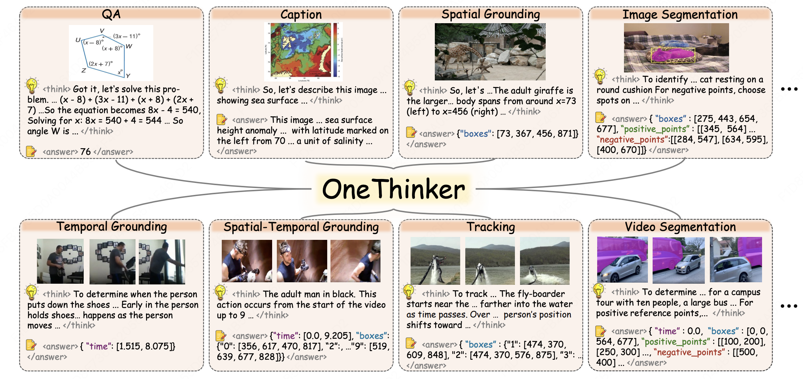
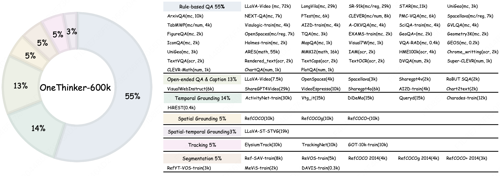
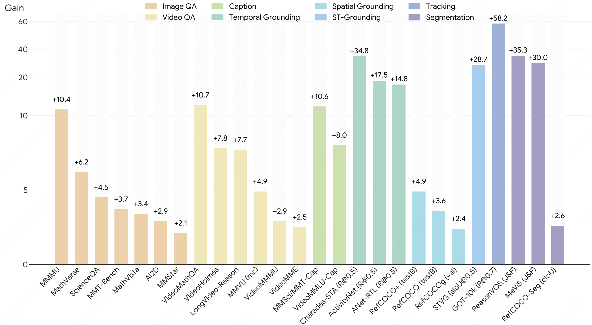
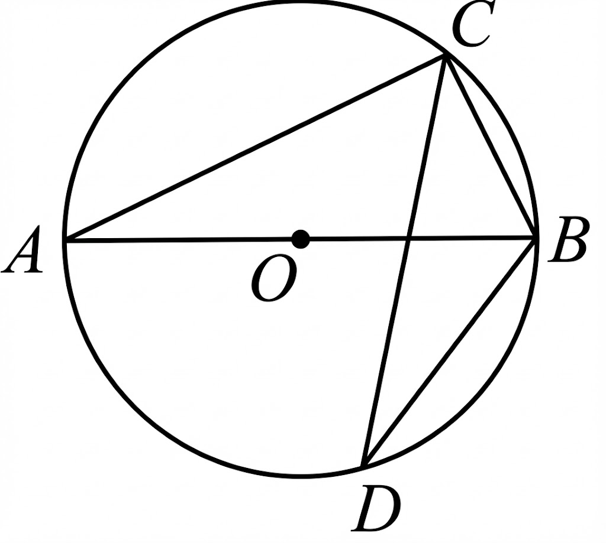
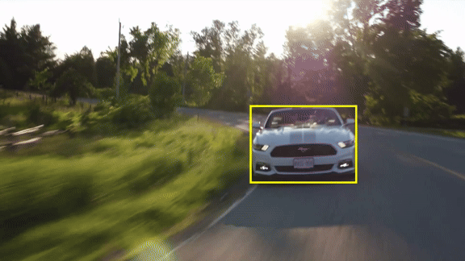

# OneThinker: All-in-one Reasoning Model for Image and Video

[[📖 Paper](https://arxiv.org/abs/2512.03043)] [[🤗 OneThinker-8B-model](https://huggingface.co/OneThink/OneThinker-8B)] [🤗[OneThinker-SFT-model](https://huggingface.co/OneThink/OneThinker-SFT-Qwen3-8B)] [[🤗 OneThinker-train-data](https://huggingface.co/datasets/OneThink/OneThinker-train-data)] [🤗 [OneThinker-eval](https://huggingface.co/datasets/OneThink/OneThinker-eval)]


## 👀 About OneThinker

<div align="center">
  
</div>

We introduce **OneThinker**, an all-in-one multimodal reasoning generalist that is **capable of thinking across a wide range of fundamental visual tasks within a single model**.

We construct the large-scale **OneThinker-600k** multi-task training corpus and build **OneThinker-SFT-340k** with high-quality CoT annotations for cold-start SFT. Moreover, we propose **EMA-GRPO**, a new RL method that **balances heterogeneous reward signals across diverse visual tasks**, via simply tracking task-wise moving averages of reward std.

OneThinker demonstrates **strong performance on 31 benchmarks across 10 fundamental vision tasks**, while showing cross-task knowledge transfer and promising zero-shot generalization toward a **unified multimodal reasoning generalist**.

All code, models, and data are fully released.


## 🔥 News
- [2025/12/03] We release the code, model, data of OneThinker

## 📍 Features

+ Support Qwen3-VL Training
+ Support Image-Video mixed training
+ Support reward types in diverse visual tasks
+ Provide full pipeline (dataset, SFT training, RL training, evaluation, etc) 

## 🔍 Dataset

Our dataset covers both image and video modalities and spans a series of fundamental visual reasoning tasks, including rule-based QA, open-ended QA, captioning, spatial grounding, temporal grounding, spatio-temporal grounding, tracking, and segmentation

<div align="center">
  
</div>

To enable effective SFT initialization for reasoning, we leverage a strong proprietary model, Seed1.5-VL  to produce CoT annotations.

## 🏆 Performance

Our model obtains significant performance gains after training based on Qwen3-VL-Instruct-8B across diverse visual tasks. For examle, OneThinker-8B reaches 70.6% accuracy on MMMU, 64.3% on MathVerse, 66.2% on VideoMMMU, 93.7 on Refcoco-testA, 54.9 J&F on ReasonVOS.


<div align="center">
  
</div>


Besides, we also observe beneficial cross-task and cross-modality knowledge transfer, along with promising preliminary zero-shot generalization under unified training. This highlights the  effectiveness and generalization ability of our unified training framework across diverse visual tasks. 


## 🎥 Demo

 Some reasoning examples are as follows.

<details open>
<summary>Demo 1 (QA)</summary>


<div align="center">
  
</div>

**Question:**  
As shown in the figure, AB is the diameter of ⊙O, and points C and D are on ⊙O. If ∠ABD = 50.0, then the degree of ∠BCD is () Choices: (A) 30° (B) 35° (C) 40° (D) 45°

<details>
<summary><b>Thinking Process (click to expand)</b></summary>
&lt;think&gt; Got it, let's try to solve this problem step by step. First, let's recall some circle theorems. \n\nWe know that AB is the diameter of circle O. So, any angle inscribed in a semicircle is a right angle. That means ∠ACB should be 90° because triangle ACB is inscribed in the semicircle with AB as the diameter. Now, let's look at ∠ABD. The problem says ∠ABD is 50°. Let's think about quadrilateral or triangles here. Maybe we can use the inscribed angle theorem, which states that an inscribed angle is half the measure of its intercepted arc. First, let's consider arc AD or arc AB. Since AB is the diameter, the arc AB is 180°. ∠ABD is an inscribed angle that intercepts arc AD. So ∠ABD intercepts arc AD, so the measure of arc AD would be 2 × ∠ABD = 2 × 50° = 100°? Wait, maybe not. Let's check another angle. Alternatively, ∠BAD and ∠BCD might be related. Let's see. ∠BAD is an inscribed angle intercepting arc BD. ∠BCD is also an inscribed angle intercepting arc BD. So they might be equal or supplementary?


Wait, AB is the diameter, so ∠ADB is also a right angle (since angle inscribed in a semicircle). So triangle ADB is a right-angled triangle at D. In triangle ADB, ∠ABD is 50°, so ∠BAD = 90° - 50° = 40°. \n\nNow, ∠BCD and ∠BAD are inscribed angles that intercept the same arc BD. Because ∠BAD intercepts arc BD, and ∠BCD also intercepts arc BD. So they should be equal. Therefore, ∠BCD = ∠BAD = 40°. Let's verify again.\n\nAB is diameter, so ∠ACB = 90°, ∠ADB = 90°. In △ABD, ∠BAD = 90° - 50° = 40°. ∠BCD and ∠BAD both subtend arc BD, so they are equal. Hence, ∠BCD is 40°, which is option C.&lt;/think&gt;

\<answe\>C\</answer\>

</details>

</details>

<details open>
<summary>Demo 2 (Tracking)</summary>


<div align="center">
  
</div>

**Question:**  
Given the bounding box [537,403,768,703] of the target object in the first frame, track this object in each frame.

<details>
<summary><b>Thinking Process (click to expand)</b></summary>
&lt;think&gt; To track the white Ford Mustang convertible across each second up to 32 seconds, observe its movement pattern: the car travels forward along the road, so its position in the frame shifts subtly over time. Initially, the car occupies a central area of the frame. As seconds pass, the car moves closer to the camera, causing its bounding box to adjust incrementally. Over each second, the car’s position shifts slightly toward the lower portion of the frame (as it approaches the camera) and its bounding box expands a bit to account for the closer perspective. Throughout the sequence, the car remains the central focus, with smooth, gradual changes in its placement and the size of the bounding box reflecting its forward motion and proximity to the camera.&lt;/think&gt;

\<answer\>{"boxes": {"1": [537, 403, 768, 703], "2": [537, 353, 797, 690], "3": [532, 323, 827, 687], "4": [519, 282, 850, 690], "5": [515, 260, 877, 694], "6": [510, 246, 887, 694], "7": [509, 246, 897, 703], "8": [509, 232, 947, 710], "9": [509, 210, 972, 732], "10": [482, 200, 989, 787], "11": [469, 196, 995, 856], "12": [459, 203, 995, 929], "13": [422, 221, 995, 987], "14": [397, 244, 995, 994], "15": [389, 250, 995, 994], "16": [382, 250, 995, 994], "17": [370, 250, 995, 994], "18": [364, 250, 995, 994], "19": [362, 250, 995, 994], "20": [354, 244, 995, 994], "21": [350, 239, 995, 994], "22": [347, 239, 995, 994], "23": [347, 244, 965, 979], "24": [350, 244, 945, 944], "25": [350, 244, 904, 910], "26": [350, 244, 845, 860], "27": [347, 244, 797, 779], "28": [347, 244, 772, 750], "29": [350, 250, 764, 742], "30": [350, 250, 757, 739], "31": [350, 250, 750, 739], "32": [350, 250, 750, 739]}}\</answer\>

</details>

</details>

<details open>
<summary>Demo 3 (Segmentation)</summary>


<div align="center">
  
</div>

**Question:**  
Pleae segment the shorter one.

<details>
<summary><b>Thinking Process (click to expand)</b></summary>
&lt;think&gt; To identify the shorter individual, focus on the person in the yellow dress. At the start of the video (around 0.0 seconds), this person is clearly visible. For positive reference points, select areas on the yellow dress itself—such as the chest, midsection, and skirt. For negative reference points, choose areas outside the person, like the road or the sky in the background.&lt;/think&gt;

\<answer\>{"time": 0.0, "boxes": [426, 300, 528, 775], "positive_points": [[454, 450], [468, 550], [472, 650]], "negative_points": [[300, 500], [600, 500], [400, 200]]}\</answer\>

</details>

</details>


## 📐 Set up

```bash
git clone https://github.com/tulerfeng/OneThinker
cd OneThinker

# build SFT environment
conda create -n llamafactory python=3.11 
conda activate llamafactory
cd LLaMA-Factory
pip install -e ".[torch,metrics]" --no-build-isolation

# build RL environment
conda create -n easyr1 python=3.11 
conda activate easyr1
cd EasyR1
pip install -e .

```

For more details for the SFT and RL environment installation, please refer to [LLaMA-Factory](https://github.com/hiyouga/LLaMA-Factory),  [EasyR1](https://github.com/hiyouga/EasyR1)

Then, download the training datasets [[🤗 OneThinker-train-data](https://huggingface.co/datasets/OneThink/OneThinker-train-data)] and unzip all the data.

The `onethinker_rl_train.json` file is for RL training while `onethinker_sft_image.json` and `onethinker_sft_video.json` is for SFT cold start. The json files end with `_unsampled` are unsampled full set.


## 🚀 Training

For SFT and RL training, a minimum of 8 × 80GB GPUs is required; alternatively, you may reduce the number of frames or the input resolution.

We first perform SFT cold start.

```bash
bash ./LLaMA-Factory/local_scripts/run_onethinker_sft.sh
```
If you want to skip the SFT process, we also provide our SFT model at [🤗[OneThinker-SFT-model](https://huggingface.co/OneThink/OneThinker-SFT-Qwen3-8B)]

Then, we perform RL training  as follows

```bash
bash ./EasyR1/local_scripts/run_onethinker_rl.sh
```

For setting Ray in multi-node training, please refer to [EasyR1](https://github.com/hiyouga/EasyR1), or you may use single-node training by setting `NNODES=1`. Performing RL training for about 200 steps can already yield strong performance.

If you want to use model-based rewards for open-ended problem, please use vllm to lanuch [POLAR-7B](https://github.com/InternLM/POLAR) and revised the setting in `/EasyR1/verl/reward_function/onethinker_reward.py`


## 🔮 Inference & Evaluation
Since OneThinker-8B shares the same architecture as Qwen3-VL-8B, it naturally supports easy and efficient inference.

For the majority of tasks and benchmarks, we recommend using our provided json files and scripts for easier evaluation. 

The json files can be downloaded at: [🤗 [OneThinker-eval](https://huggingface.co/datasets/OneThink/OneThinker-eval)]

Download the trained model [[🤗 OneThinker-8B-model](https://huggingface.co/OneThink/OneThinker-8B)]

Conduct evaluation on all benchmarks using the following scripts

```bash
bash ./Evaluation/Eval/eval_bench_all.sh
```
If you want to perform evaluation on segmentation tasks, please download and install [sam2](https://github.com/facebookresearch/sam2) and revise the related path in `/Evaluation/Eval/seg_post_sam2.py` 

For image QA and part of video QA, we use  [VLMEvalKit](https://github.com/open-compass/VLMEvalKit) for evaluation, please install corresponding environment and run:

```bash
bash ./Evaluation/VLMEvalKit/local_scripts/eval_vlmevalkit.sh
```

For infernce on a single example, you may refer to:

```bash
python ./Evaluation/inference_single/inference.py
```


## Acknowledgements

We sincerely appreciate the contributions of the open-source community. The related projects are as follows: [Video-R1](https://github.com/tulerfeng/Video-R1), [DeepSeek-R1](https://github.com/deepseek-ai/DeepSeek-R1), [EasyR1](https://github.com/hiyouga/EasyR1), [verl](https://github.com/volcengine/verl),  [LLaMA-Factory](https://github.com/hiyouga/LLaMA-Factory), [VLMEvalKit](https://github.com/open-compass/VLMEvalKit)

## Citations

If you find our work helpful for your research, please consider citing our work.   

```
@article{feng2025onethinker,
  title={OneThinker: All-in-one Reasoning Model for Image and Video},
  author={Feng, Kaituo and Zhang, Manyuan and Li, Hongyu and Fan, Kaixuan and Chen, Shuang and Jiang, Yilei and Zheng, Dian and Sun, Peiwen and Zhang, Yiyuan and Sun, Haoze and others},
  journal={arXiv preprint arXiv:2512.03043},
  year={2025}
}
```
